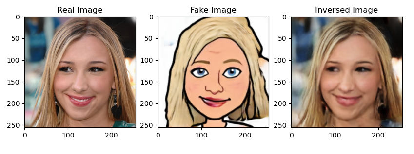
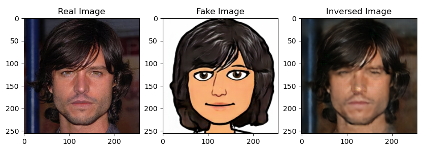
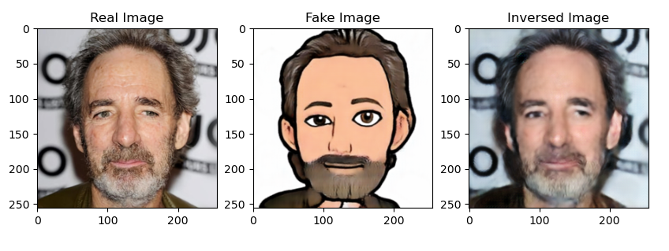

# cycle_gan
Trying to implement base cycle-gan in PyTorch

The generator model starts with best practices for generators using the deep convolutional GAN, which is implemented using multiple residual blocks (e.g. from the ResNet).

PatchGANs are used in the discriminator models to classify 70×70 overlapping patches of input images as belonging to the domain or having been generated. The discriminator output is then taken as the average of the prediction for each patch.

Additionally, a buffer of 50 generated images is used to update the discriminator models instead of freshly generated images

The models are trained with the Adam version of stochastic gradient descent and a small learning rate for 100 epochs, then a further 100 epochs with a learning rate decay. The models are updated after each image, e.g. a batch size of 1.

## Examples (from train logs)

Use bias = True if InstanceNorm2d, in case of batchNorm2d -> False

Batch Norm + grad accumulation.

#### Distributed Training
- https://medium.com/analytics-vidhya/distributed-training-in-pytorch-part-1-distributed-data-parallel-ae5c645e74cb
- https://medium.com/analytics-vidhya/distributed-training-in-pytorch-part-1-distributed-data-parallel-ae5c645e74cb
- https://towardsdatascience.com/why-parallelized-training-might-not-be-working-for-you-4c01f606ef2c

#### Saving Weights
- https://towardsdatascience.com/everything-you-need-to-know-about-saving-weights-in-pytorch-572651f3f8de

#### In case of small Dataset:
- https://www.kaggle.com/unfriendlyai/diffaugment-is-all-you-need

#### Multi-Disc
- https://arxiv.org/pdf/1710.06090.pdf
- https://arxiv.org/pdf/1712.03451.pdf
- https://arxiv.org/pdf/1907.01424.pdf

#### How to properly use SyncBatchNorm

#### Batch Norm export trick
- https://discuss.pytorch.org/t/why-dont-we-put-models-in-train-or-eval-modes-in-dcgan-7422/example
